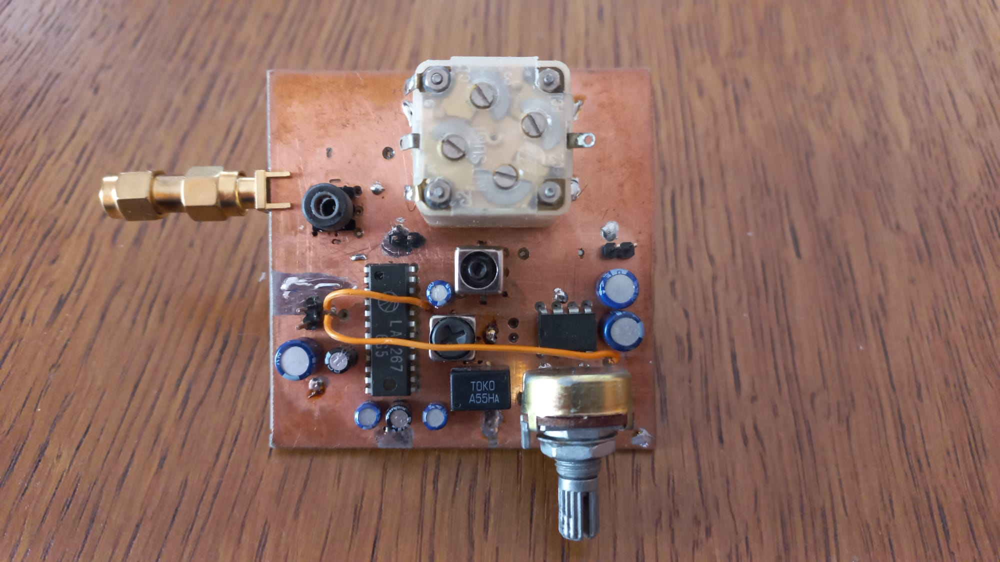

# AiRX
AiRX is a modularized fully-analog superheterodyne AM radio receiver for the aviation band (117-140MHz). The system consists of an input filter + LNA, a LNA + mixer stege for converting the band to 7-30MHz range, a Xtal oscillator at 110MHz as the first LO, and a LA1267 based AM radio to demodulate the signal with an additional LM386 amp for driving speakers.

.png)

## Input Stage
The input stage is a 9th order bandpass filter (117-40MHz passband) made using high-q aircore inductors. Right after the filter, there is a LNA block made using the BFP196W RF transistor. Bias network is made using a BC807 PNP transistor. The circuit aims to provide a 15mA current flow over the RF transistor. The overall gain of the LNA block here is around 15dB. The final PCB ins enclosed in a phosphorus-bronze enclosure and the power supply cable is filtered by going through a ferride bead to minimize the RF interference by nearby electronics.

The input stage inside it's enclosure. The sides of the lid are bent frequently with small cuts to improve the seal.

The populated PCB of the input stage. The 3rd SMA connector on the long edge was a temporary test point between the filter and LNA.

## 110MHz Oscillator
A 22MHz crystal is used in 5th overtone to achieve 110MHz 1st LO frequency. There is a filter at the output of the oscillator buffer to filter out any potential harmonics/noise.

## Mixer Stage
The mixer used to bring the band down to the HF range is a SA612 double balanced mixer. At the RF input there is another LNA based on the same BFP196W transistor. It's the same circuit as the input stage LNA, only difference being that the current going through the transistor is roughly 1.4x higher. After that, the signal is fed to the 612's RF input with a 4:1 balun. Since the input impedance of the 612 is around 2kOhms, this balun allows the output of the transistor to be matched better than a straight transmission line. Since the band used is pretty wide, a matching network was not a practical solution in this case.
The 110MHz is directly fed into the base of the internal oscillator transistor of the 612.
At the output, there is a LPF with a cutoff frequency of 30MHz. This both filters out the images and reduces the overall noise level of the system.

The back side of the mixer module.

The front side of the mixer module.

## AM Demodulator
The signals from the mixer module is directly fed to the input of this module. This is a superheterodyne shortwave radio based on the LA1267 chip by Sanyo. At the input, there is a variable band selective filter. The variable capacitor determines the band, as well as the LO frequency of the radio. The audio output is then fed into a LM386 amplifier. The outout can be directly used to drive medium-sized speakers. For the sake of conveniency, I later used a Si5351 frequency sythesizer controlled by an Arduino as the LO to precisely select the band that I wanted to listen to. I was able to account for the slight offset(24KHz) of the 110MHz oscillator with this solution, while achieving precise frequency control. This was a huge improvement since the bandwith is limited to 6-8KHz, which makes it hard to manually adjust the frequency using the variable capacitor without any pulley system. 

The back side of the demodulator module.

The front side of the demodulator module.

## Planned future updates
I'm palnning on using a variable frequency filter for the input stage, which shoould help with the overall sensetivity of the system by limiting the witdh of the band admitted. Also, I want to use a more powerful mixer for the fisr mixer stage, so the dynamic range of the system can be improved. An AGC system is also within my plans.
